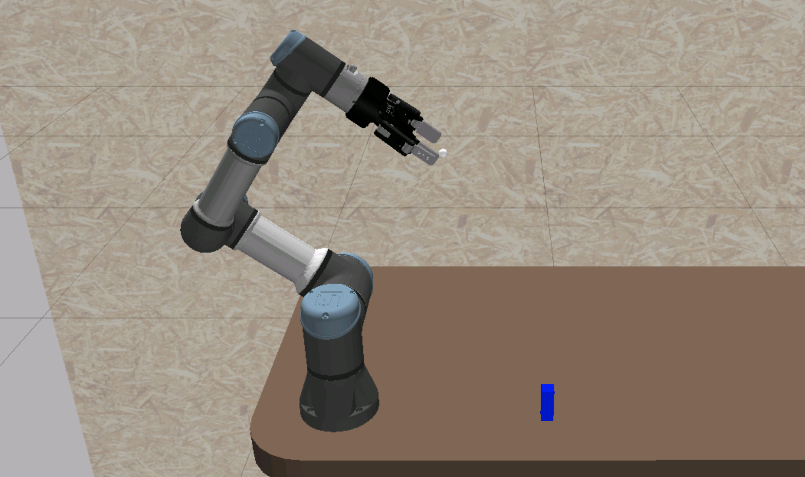
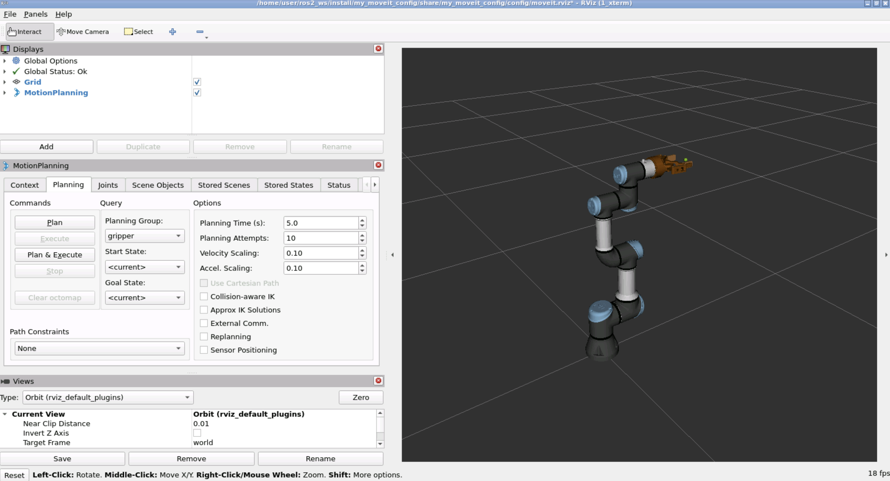
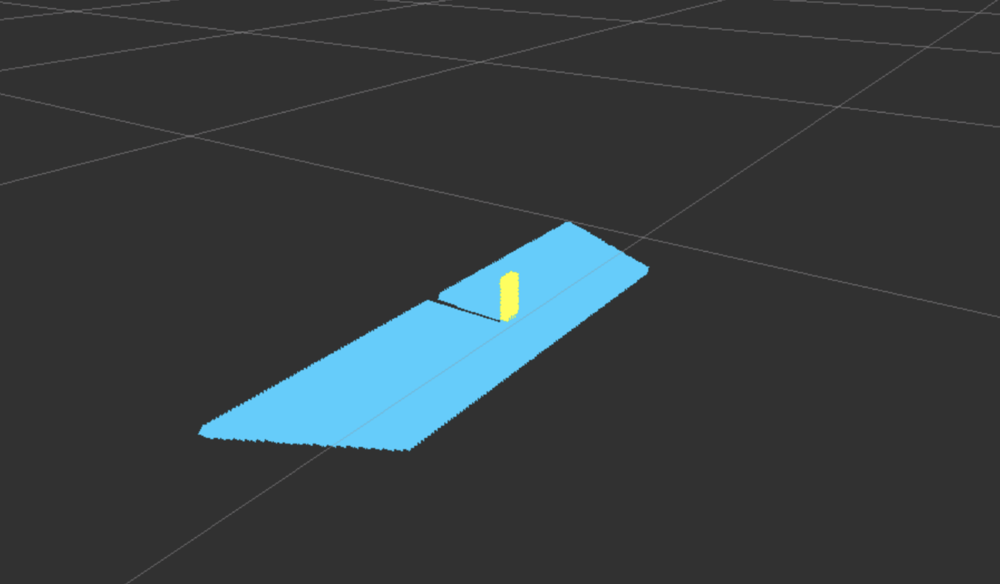

# Robot Perception

This project enhances a Pick & Place task by integrating a Perception node that detects objects on a table and determines their positions relative to the robotic arm. The Perception node will be developed first to identify and locate the object, and then integrated to provide real-time positional data to the Pick & Place task, ensuring precise and dynamic object manipulation.

  

## Structure

```text
.
├── get_cube_pose
│   ├── data
│   │   ├── sample_no_object.txt
│   │   └── sample_object.txt
│   ├── launch
│   │   └── get_pose_client.launch.py
│   ├── rviz
│   ├── src
│   │   └── get_pose_client.cpp
│   ├── CMakeLists.txt
│   └── package.xml
├── moveit2_scripts
│   ├── launch
│   │   └── pick_and_place_perception.launch.py
│   ├── src
│   │   ├── pick_and_place_perception_real.cpp
│   │   └── pick_and_place_perception_sim.cpp
│   ├── CMakeLists.txt
│   └── package.xml
├── my_moveit_config
│   ├── config
│   │   ├── name.srdf
│   ├── launch
│   │   ├── move_group.launch.py
│   │   ├── moveit_rviz.launch.py
│   ├── CMakeLists.txt
│   └── package.xml
├── real_moveit_config
│   ├── config
│   │   ├── name.srdf
│   ├── launch
│   │   ├── move_group.launch.py
│   │   ├── moveit_rviz.launch.py
│   ├── CMakeLists.txt
│   └── package.xml
└── Makefile
```

## Setup

#### Distribution

Use docker for quick-start (for both ROS1 or ROS2):

```bash
# using docker for ROS1
$ docker run -ti --rm --name local-ros-noetic ros:noetic
# using docker for ROS2
$ docker run -ti --rm --name local-ros-humble ros:humble
```

#### Build (Package)

Now, create a ros2 workspace, clone the package:

```bash
# setup directory
$ mkdir ~/ros2_ws/src/
$ git clone <repo_name> ~/ros2_ws/src/
```

Install the required packages (dependency) mentioned in `package.xml` using `apt`:

```bash
# check if package is available
$ ros2 pkg list
$ ros2 node list
# update path to installed packages
$ source /opt/ros/humble/setup.bash
```

To build locally or inside docker use the following commands:

```bash
# execute build
$ cd ~/ros2_ws && colcon build
$ source ~/ros2_ws/install/setup.bash
```

## Robot

The `UR3e` is a compact collaborative robot (cobot) designed for precise, efficient automation in confined spaces, ideal for industries requiring high flexibility and safety. Its lightweight design and advanced safety features allow it to work alongside humans in various settings, including tabletop operations and integrated workstations.



All the different joints invloved in `UR3e` robot.

```text
- shoulder_pan_joint
- shoulder_lift_joint
- elbow_joint
- wrist_2_joint
- wrist_3_joint
- wrist_1_joint
- robotiq_85_left_knuckle_joint
```

**Note:** Check more details about `UR3e` from [here](https://www.universal-robots.com/products/ur3-robot/).

## Launch

The `move_group.launch.py` launch script used to configure and run the Move Group node in MoveIt2, which handles motion planning, manipulation, and interaction with the robot's kinematic model and `moveit_rviz.launch.py` launch script that sets up and runs an RViz session pre-configured with the MoveIt2 plugin.

```bash
# terminal 1
$ ros2 launch my_moveit_config move_group.launch.py
```

```bash
# terminal 2
$ ros2 launch my_moveit_config moveit_rviz.launch.py
```



The `get_pose_client.launch.py` launch file contains the followings nodes:

- `basic_grasping_perception_node`
- `get_cube_pose_node`

```bash
# terminal 1
$ ros2 launch get_cube_pose get_pose_client.launch.py
```

<pre style="color: white; background: black; padding:10px; font: 0.8rem Inconsolata, monospace;">
[INFO] [1718954752.909632661] [get_cube_pose_node]: /find_objects accepted the goal
[INFO] [1718954753.410830164] [object_support_segmentation]: object support segmentation starting...
[INFO] [1718954754.934751563] [object_support_segmentation]: object support segmentation done processing.
[INFO] [1718954754.952707401] [get_cube_pose_node]: X : 0.327921, Y : -0.010783
[INFO] [1718954754.952781048] [get_cube_pose_node]: is_approachable : `true`
</pre>

```bash
# terminal 3
$ ros2 launch moveit2_scripts pick_and_place_perception.launch.py
```


**Note :** Above image is for real lab and is using RGB-D camera for geting exact location of the the cube for calculation of inverse kinematics.

## Specifications

#### Point Cloud

A point cloud is a collection of data points defined in a three-dimensional coordinate system, representing the external surface of an object or scene. These points are typically generated by 3D scanners or other remote sensing technologies, capturing the dimensions and spatial relationships of the object or area.

```bash
# terminal 1
$ ros2 run simple_grasping basic_grasping_perception_node --ros-args -p debug_topics:=true
```



**Note:** More details about `simple_grasping` package from [here](https://github.com/mikeferguson/simple_grasping/tree/ros2).

## Roadmap

- [x] Task 1 : Get the cube's position using point cloud data.
- [x] Task 2 : Pick & place cube with perception.

See the [open issues](https://github.com/llabhishekll/robot_perception/issuess) for a full list of proposed features (and known issues).

## Tools

System tool/modules used for project development.

- `Applications` : [vs-code](https://code.visualstudio.com/), [ros-extensions](https://marketplace.visualstudio.com/items?itemName=ms-iot.vscode-ros) and [docker-desktop](https://docs.docker.com/get-docker/).
- `ROS` : [ros-docker-images](https://hub.docker.com/_/ros/) (`humble`, `noetic`) or [build-source](https://www.ros.org/blog/getting-started/).

## License

Distributed under the MIT License. See `LICENSE.txt` for more information.
